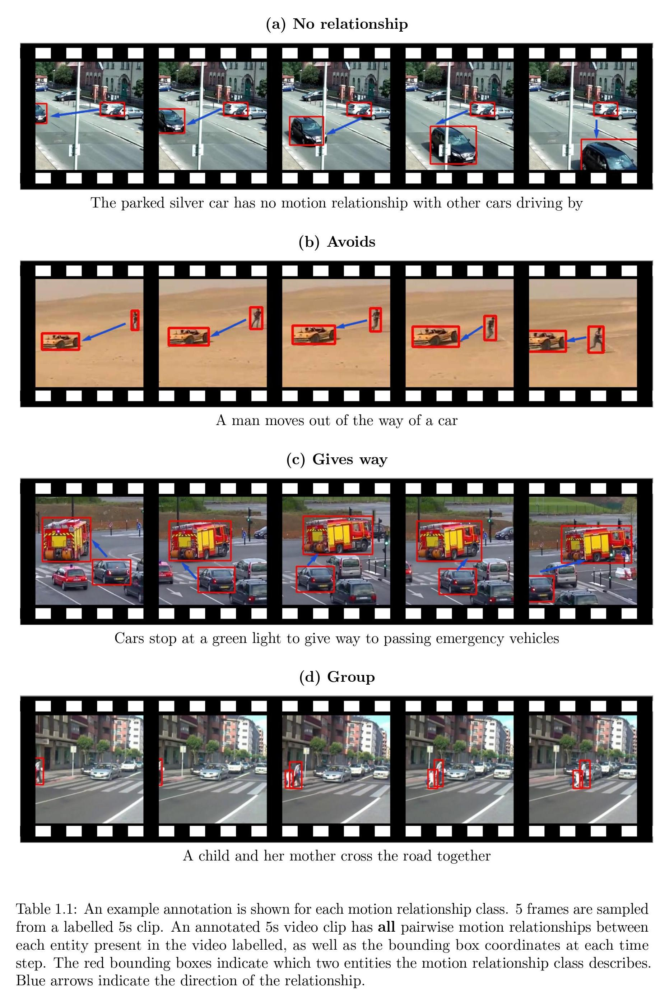

# Motion Relationships

This repository contains all the code for my Master's thesis at UCL: **Predicting motion relationships in video**.

The report can be viewed [here](https://cdn.galenhan.com/documents/university/thesis/Thesis-Predicting_Motion_Relationships_in_Video.pdf).

## Prerequisites

* Copy `.env.example` to `.env`
* Fill in API keys
* Install Python packages `pip install -r requirements.txt`

## Annotation Interface

The code for the annotation interface used for collecting annotations on AMT can be found inside `annotation-ui`.

## Scripts

Executable scripts for various pre-processing tasks can be found within the `scripts/` directory.
Each script is individually documented.

## Models

To train/run the motion relationship models see `lib/model/architectures`.

## Dataset

The annotated dataset can be downloaded [here](https://cdn.galenhan.com/documents/university/thesis/motion-relationship-dataset.zip).